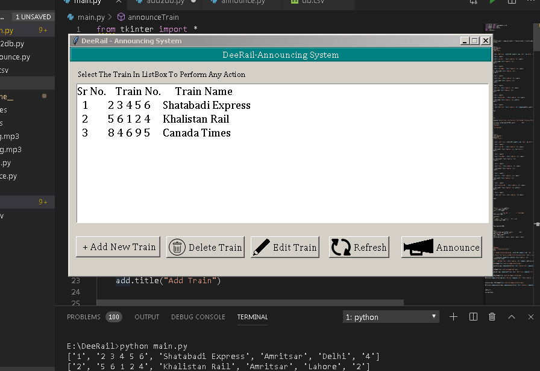

# Railway-announcement-system
This is a Program which generates the announcement for the train which is selected by user in Hindi. This was made using gTTS and tkinter for the GUI.

# Requirements

1. gTTS

2. playsound

3. csv

4. tkinter

# How To Run

1. Just Hit the main.py file.

2. Add your train or select any train in the listbox.

3. Hit the annouce button.

4. Takes few seconds and announcement starts.

# Screenshots

